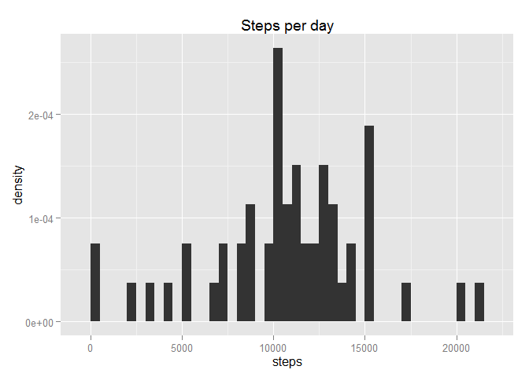
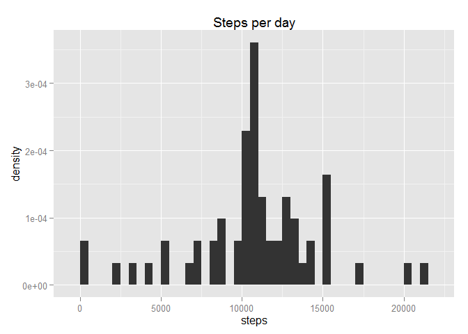
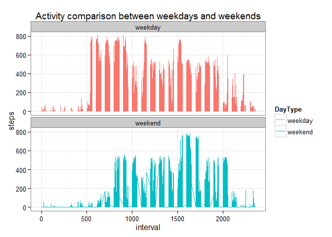

# Reproducible Research: Peer Assessment 1


## Loading and preprocessing the data


```r
DataUrl<-file.path(getwd(),"activity.csv")

Data<-read.table(DataUrl,header = T, sep = ",")
names(Data)
```

```
## [1] "steps"    "date"     "interval"
```

```r
#lets get some proper dates
Data$date<-as.POSIXct(paste(Data$date), format="%Y-%m-%d")
```


## What is mean total number of steps taken per day?


```r
NoOfDays<-length(unique(Data$date))
#aggregate by days
DailyWalk<-aggregate(steps ~ date,Data,sum)
summary(DailyWalk$steps,na.rm = T)
```

```
##    Min. 1st Qu.  Median    Mean 3rd Qu.    Max. 
##      41    8841   10760   10770   13290   21190
```

Data was taken over 61 days, with mean of 1.0766189\times 10^{4} and median of 10765 steps taken per day. 

Data histogram suggest that activities vary from day to day


```r
library(ggplot2)
```

```
## Warning: package 'ggplot2' was built under R version 3.1.3
```

```r
HistPlot<-ggplot(DailyWalk, aes(steps)) + geom_histogram(aes(y = ..density..), binwidth = 500) + labs(title = "Steps per day")
HistPlot
```

 


## What is the average daily activity pattern?

Lets compare average number of steps, across all days, in each interval. 


```r
#aggregate by days
DailyWalk<-aggregate(steps ~ interval,Data,mean)
summary(DailyWalk$steps,na.rm = T)
```

```
##    Min. 1st Qu.  Median    Mean 3rd Qu.    Max. 
##   0.000   2.486  34.110  37.380  52.830 206.200
```


Represent it as a time series.


```r
ggplot(DailyWalk, aes(interval, steps))+geom_line()
```

 

```r
TimeofMaxActivity<-DailyWalk$interval[DailyWalk$steps==max(DailyWalk$steps)]
```

Across all days peak of activity (no of steps), is around 835 interval.


## Imputing missing values


```r
#find N/As
MissingValues<-sum(!complete.cases(Data))
```

We got a total of 2304 ()missing records. 

We will replace NAs with average value for particular interval.


```r
library(plyr) #arrange
```

```
## Warning: package 'plyr' was built under R version 3.1.3
```

```r
MisingValueMask<-!complete.cases(Data)

NAsFiller<-merge(Data[MisingValueMask,c("date","interval")],DailyWalk,by="interval",sort=F )
NAsFiller<-arrange(NAsFiller,date)

DataCorrected<-Data
#create a set without NAs
DataCorrected[MisingValueMask,c("steps")]<-NAsFiller[,c("steps")]
```

Lets compare how repacement of NAs changes mean and median total number of steps taken per day.


```r
#aggregate by days
DailyWalk<-aggregate(steps ~ date,DataCorrected,sum)
summary(DailyWalk$steps,na.rm = T)
```

```
##    Min. 1st Qu.  Median    Mean 3rd Qu.    Max. 
##      41    9819   10770   10770   12810   21190
```

```r
#replog ggplot with upgraded dataframe
HistPlot %+% DailyWalk
```

 

**DataCorrected** mean is 1.0766189\times 10^{4} and median is 1.0766189\times 10^{4} steps taken per day. 
Filling in NAs has removed small skew in the data, with mean and median bein now almost equal


## Are there differences in activity patterns between weekdays and weekends?

Lets identify weeekdays and weekends first.


```r
DayOfWeek<-weekdays(Data$date, abbreviate=T)

#define weekend
Data$DayType<-"weekday"
Data$DayType[DayOfWeek %in% c("Sat","Sun")]<-"weekend"
```

Lets plot and compare.


```r
ggplot(aes(x=interval,y=steps),data = Data)+geom_line(aes(colour = DayType))+  theme_bw()+facet_wrap(~DayType,nrow=2) +  labs(title = "Activity comparison between weekdays and weekends",legend.position = "none")  
```

```
## Warning in loop_apply(n, do.ply): Removed 2 rows containing missing values
## (geom_path).
```

 

There is difference in activities between weekends and weekdays.

